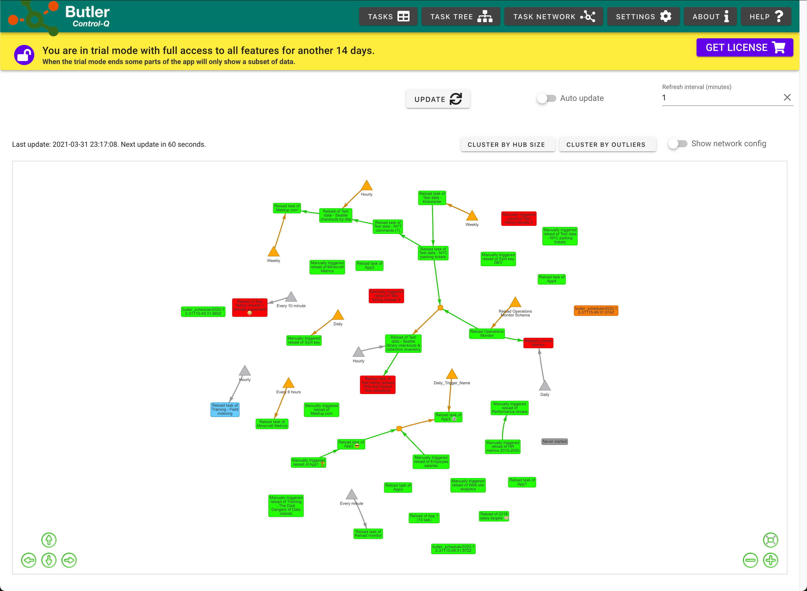

## Butler Control-Q: A better admin console for Qlik Sense.

This repository...

1. Is the central download repository for Butler Control-Q.  
   Current and past versions are available in the [Releases](https://github.com/ptarmiganlabs/butler-control-q-public/releases) section.
2. Contains the public [bug/issues/feature tracker](https://github.com/ptarmiganlabs/butler-control-q-public/issues).
3. Provides a [discussion forum](https://github.com/ptarmiganlabs/butler-control-q-public/discussions) in which you can ask questions, describe ideas for new features etc.

Butler Control-Q can be freely downloaded from this site.  
When started it will go into trial mode.  

Once trial mode ends some parts of the app will become limited and only show some of the data retrived from Qlik Sense Enterprise.  
Use the in-app license store to purchase a license that will unlock all features for the following 12 months.

## What's Butler Control-Q?

It's a cross platform application (Windows, macOS) that try to make the life of QSEoW (Qlik Sense Enterprise on Windows) admins a bit easier. The standard Qlik Management Console (=QMC) is good, but it lacks advanced features.

Butler Control-Q includes features such as

- View task reload chains in hierarchical tree views, similar to how QlikView's management console works. Example [below](#task-tree-table).
- View task dependencies as networks, with the network nodes being Sense reload tasks and the links between nodes being task triggers. While this may seem like something of academic interest, it's an extremely useful tool for understanding (and fixing broken!) long, complex reload chains. Example [below](#task-network).
- Easily copy any task related information to the clipboard (just right-click, then "copy cell").
- Export detailed task information as CSV, JSON or YAML. Great for debugging your Sense API integrations.
- Easy view into what tasks are scheduled (daily, hourly, one-time etc) and what tasks don't have a schedule.

## Can I try it?

Yes! While it's still early days for Control-Q, the beta program is open.

The beta versions are available in the [releases](https://github.com/ptarmiganlabs/butler-control-q-public/releases) section of this GitHub project.  

Butler Control-Q is currently (March 2021) in active development with new beta versions released weekly (or even more often).  

The features offered by the beta versions are - to the best of our knowledge - stable and production ready. Even the beta versions should thus be quite useful for anyone doing work on Qlik Sens Enterprise on Windows servers.  

    If you use these beta versions, we kindly ask that you share experiences, bugs, ideas etc here on GitHub.

## The fine print

### Trial version

When first started the program will go into a 14-day trial mode.  
During the trial you have access to all features, including new app versions if/when they are released.

Once the trial expired the program will still give a fully featured view into all reload tasks in the Sense server, but the tree and network views of tasks will be limited to only show a subset of all tasks.

An online license store is coming, but it's not quite there yet.
Once available you will be able to buy a license from within Butler Control-Q itself. More to come here in future versions.

### Installation

The installers for both Windows and macOS are digitally signed as requrested by Microsoft and Apple, but may still trigger warnings when installed.  
This is normal behaviour for new, not yet widely used Windows and macOS apps (unless they are signed in ways involving lots of $$$ to Microsoft and Apple).

### Upgrading from earlier versions

The program has a built-in auto-update feature.  
Run the "Check for updates..." command from the menu. If there's a new version available you will get a question if you want to install it.

You can also download the installer for the new version and install it manually. All settings from previous version will remain.

## Sample screen shots

### Plain task table

### Task tree table

### Task network

