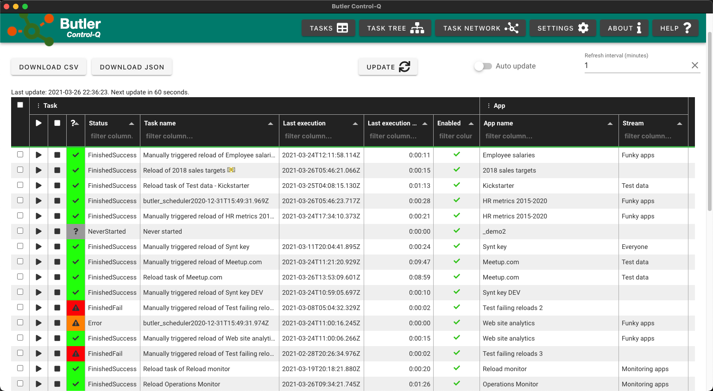
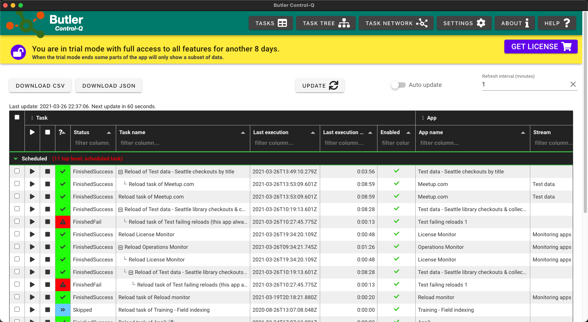
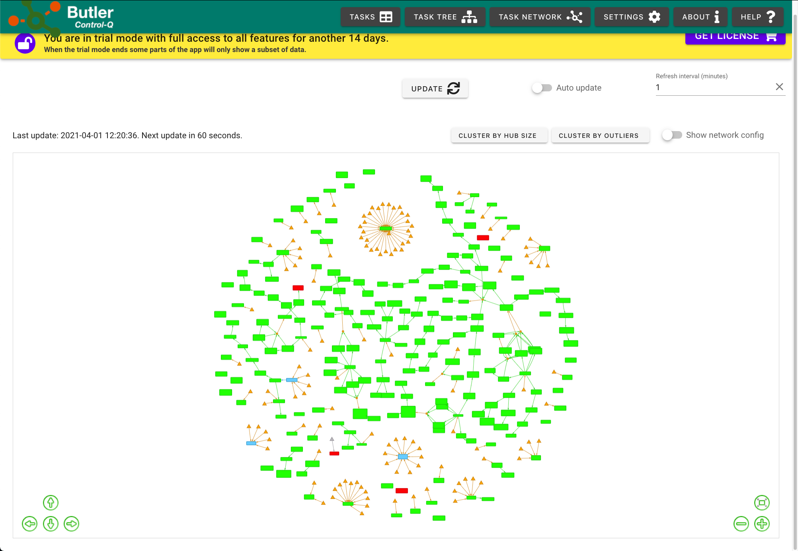
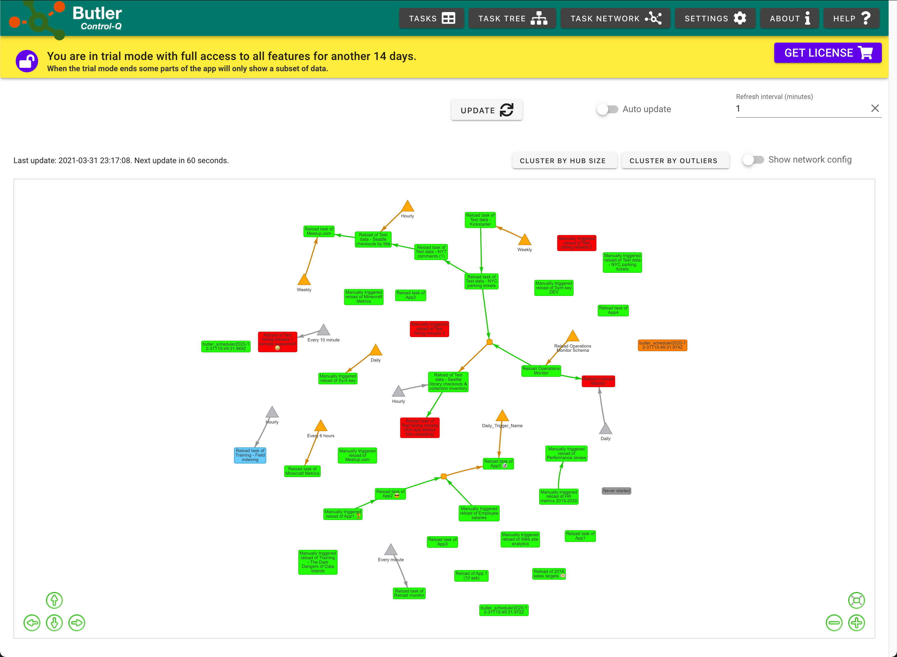

## Butler Ctrl-Q: A better admin console for Qlik Sense.

This repository...

1. Is the central download repository for Butler Ctrl-Q.  
   Current and past versions are available in the [Releases](https://github.com/ptarmiganlabs/butler-ctrl-q-public/releases) section.
2. Contains the public [bug/issues/feature tracker](https://github.com/ptarmiganlabs/butler-ctrl-q-public/issues).
3. Provides a [discussion forum](https://github.com/ptarmiganlabs/butler-ctrl-q-public/discussions) in which you can ask questions, describe ideas for new features etc.

## What's Butler Ctrl-Q?

It's a cross platform application (Windows, macOS) that try to make the life of QSEoW (Qlik Sense Enterprise on Windows) admins a bit easier. 
A powertool for Sense admins, if you like.  

Butler Ctrl-Q includes unique features such as

- View task reload chains in hierarchical tree views, similar to how QlikView's management console works. Example [below](#task-tree-table).
- View task dependencies as networks, with the network nodes being Sense reload tasks and the links between nodes being task triggers. While this may seem like something of academic interest, it's an extremely useful tool for understanding (and fixing broken!) long, complex reload chains. Examples [below](#task-network).
- Easily copy any task related information to the clipboard (just right-click, then "copy cell").
- Export detailed task information as CSV, JSON or YAML. Great for debugging your Sense API integrations.
- Easy view into what tasks are scheduled (daily, hourly, one-time etc) and what tasks don't have a schedule.

For now it's a read-only tool: It lets you view reload task related information, but not edit it.  
This may change in future versions.

## Can I try it?

Yes! While it's still early days for Ctrl-Q, the beta program is open.

The beta versions are available in the [releases](https://github.com/ptarmiganlabs/butler-ctrl-q-public/releases) section of this GitHub project.  

Butler Ctrl-Q is currently (May 2021) in active development with frequent releases of new versions.  

The features offered by the beta versions are - to the best of our knowledge - stable and production ready. Even the beta versions should thus be quite useful for anyone doing work on Qlik Sens Enterprise on Windows servers.  

    If you use these beta versions, we kindly ask that you share experiences, bugs, ideas etc here on GitHub.

## Can I buy it?

Soon! The app has a built-in license store, but it's not quite ready yet. Once it becomes operational, just click on the yellow trial toolbar and follow the instructions.

If you prefer to do this from a browser the address is [store.ptarmiganlabs.com](https://bcq.ptarmiganlabs.com/shop.html).  
There you also find licensing terms etc.

## Features

### Basic table view

This view is essentially a superset of the task view available in QSEoW's Qlik Management Console (QMC).

Features include:

- One row per reload task.
- Customisable auto refresh timer (1-10 minutes).
- The current status for each task (running, finished successfully, failed etc) is shown in its own, color coded column.
- Individual columns can be shown/hidden from the menus in the Task and App column headers. 
   The hide/show status for each column is remembered and will be used next time the application starts.
- Tasks can be started/stopped from dedicated columns within the table, or by right clicking a task and select start/stop task.
- If multiple tasks are selected they can all be started/stopped by right clicking and selecting start/stop task.
- Right clicking a row (=task) also lets you copy all data for the current task to the clipboard
- The contents of any table cell can be copied to the clipboard from the right-click menu
- The full JSON structure for the current task can be copied to clipboard from the right click > Developer menu.
- The complete table can be downloaded as JSON or CSV
- Table page size can be changed to show 20, 50 or 100 tasks in a single page.

### Tree table view

Same features as the basic table plus these:

- The tree table is grouped on scheduled and non-scheduled tasks.  
  A scheduled task is a task that has at least one date/time trigger.
- The `Task name` column contains a [tree view](#task-tree-table)) of task dependencies.  
  If a task is part of more than one reload chain it will appear more than once in the task tree view. This also means that the total number of rows in the table may be higher than the total number of reload tasks in the Sense server.

### Network view

A network chart is a visualisation that's often used to describe relations between objects or people. A person's "social network" on Facebook can for example be described using a network chart: The people are "nodes" between which connections ("edges") exist. 

In the Sense world the nodes represent Sense reload tasks, while the connections ("edges" in network chart lingo) between those tasks are various kinds of triggers.

- Great for showing how large and/or complex reload chains are set up.
- Tasks can be clustered based on various criteria. This is useful to reduce the complexity of large (hundreds or thousands) task networks.
- Metatasks=schema events and composite events.

## The fine print

### Trial version

When first started the program will go into a 14-day trial mode.  
During the trial you have access to all features, including new app versions if/when they are released.

When the trial expires the program will still give a fully featured basic view into all reload tasks in the Sense server, but the tree and network views of tasks will be limited to only show a subset of all tasks.

### Installation

The installers for both Windows and macOS are digitally signed as requested by Microsoft and Apple, but may still trigger warnings when installed.  
This is normal behaviour for new, not yet widely used Windows and macOS apps (unless they are signed in ways involving lots of $$$ to Microsoft and Apple).

### Upgrading from earlier versions

The program has a built-in auto-update feature.  
Run the "Check for Updates..." command from the menu. If there is a new version available you will get a question if you want to install it.

You can also download the installer for the new version and install it manually. All settings from previous version will remain.

## Security

The current version of BCQ is read-only, i.e. it is not possible to change any information about Sense reload tasks, applications etc. 

The certificates used to authenticate with QSEoW are stored in BCQ's config file. The config file itself is encrypted with a basic crypto, but it's primarily a way to avoid clear text storage of the certificates and other information in the config file.

### Performance

All tasks in the target Sense server are loaded into Control-Q. This has been tested on servers with hundreds of tasks, but just querying Sense and then transfering the results to Control-Q does take a while. As an example, in one case 250 tasks on a single-node QSEoW server takes 10-15 seconds to download and another few seconds to render as network charts. The table views are typically quicker to update than the network view.

### Trademarks and legalese

Butler Control-Q is an application developed by Ptarmigan Labs AB. It is an independent add-on to Qlik Sense Enterprise on Windows.

While lots of effort goes into making Butler Control-Q stable, reliable and safe, the application is provided 'as is' without any express or implied warranty of any kind.

Full terms and End User License Agreement [here](https://github.com/ptarmiganlabs/butler-control-q-public/blob/main/eula.md).

## Sample screen shots

### Plain task table

### Task tree table

### Task network

